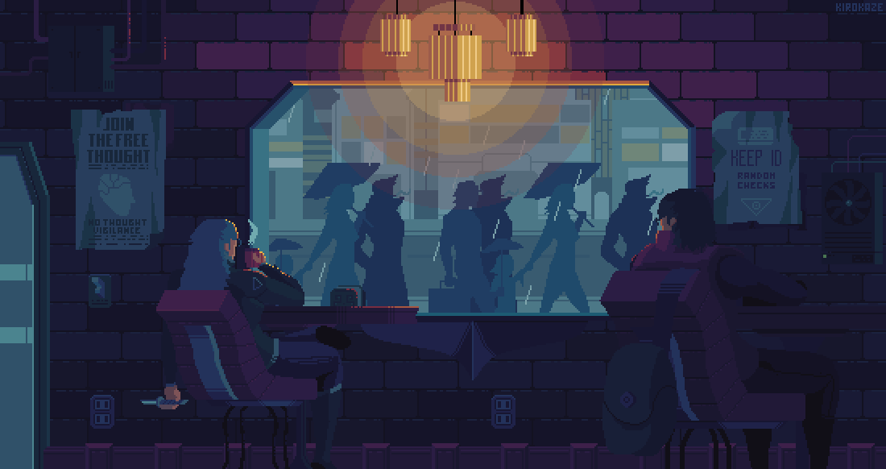
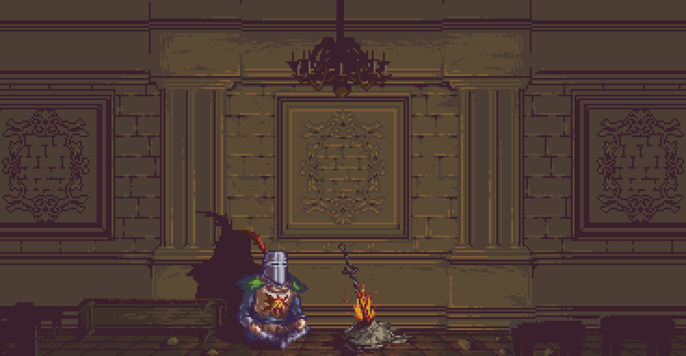

# Personal homepage for browser

This page is thought to be downloaded and set as your browser homepage.

## Demo

[https://gomezportillo.github.io/homepage/](https://gomezportillo.github.io/homepage/)

## To do

- [ ] Integrate a themed searchbox linked to Google.
- [ ] Integrate both versions with different backgrounds to be able to toggle between them.
- [x] Make the clock on the background functional overlaying a couple of clock hands with matching colours.
- [x] Add custom icons to the menu.
- [x] Make icons grow and change opacity on hover.
- [x] Add glitch effect to links on hover.

## Backgrounds

